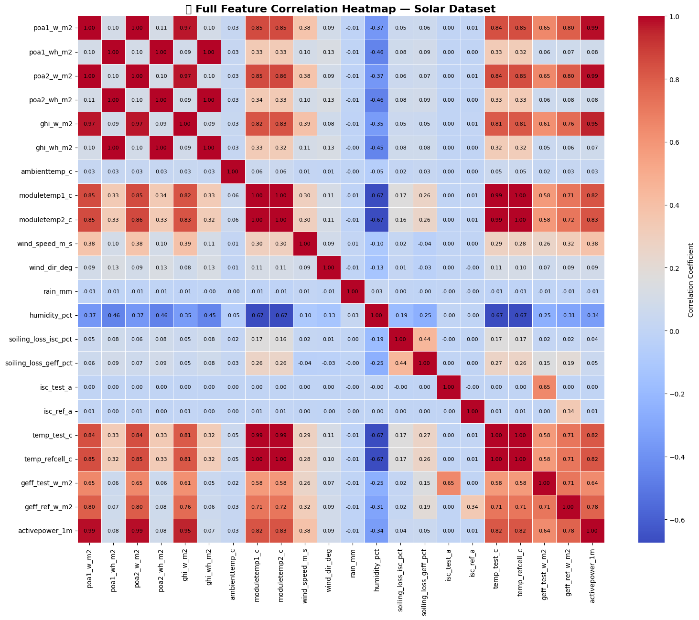
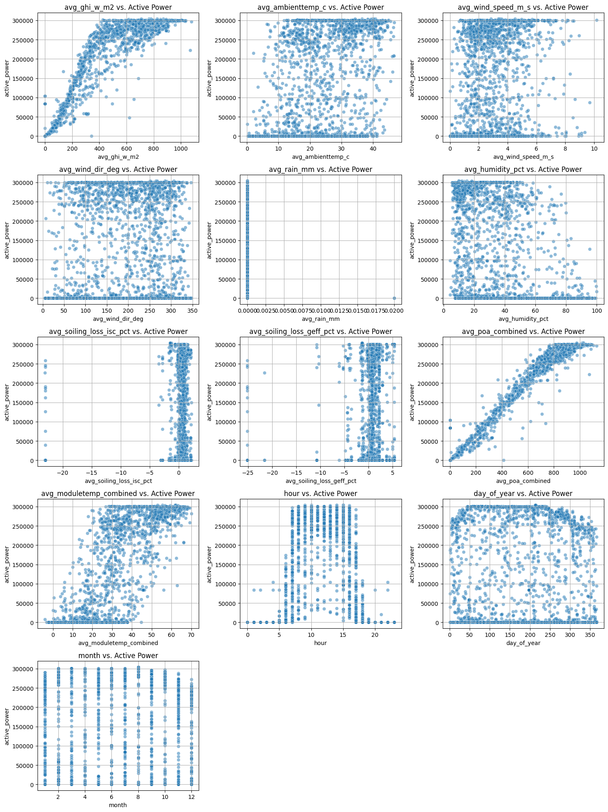
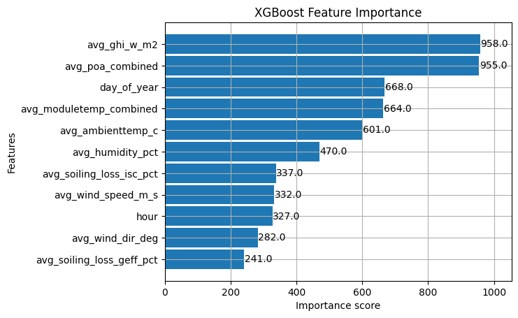
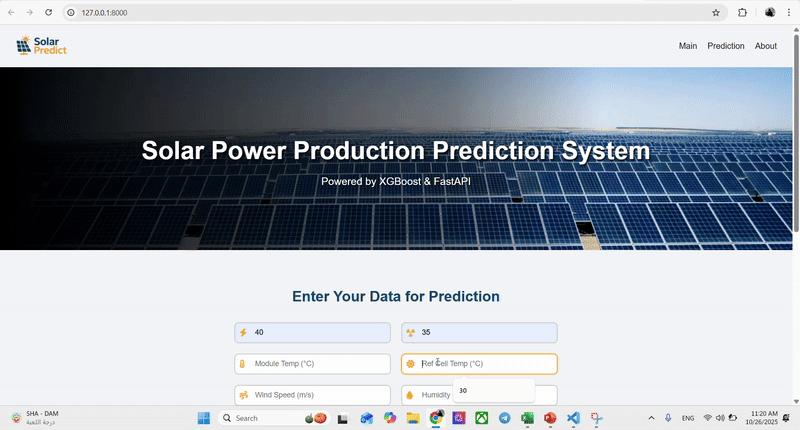

#  Solar Power Forecasting System  
**Spark Internship Project — AI UNIT, King Khalid University**

---

##  Overview

This project presents a **machine learning–based solar power prediction system** trained on real solar panel sensor data collected over a full year with minute-level resolution.  
The system predicts **active power output (W)** based on irradiance, temperature, and environmental features.  
- **XGBoost Predictive Model (1-minue aggregation)**

The **1-minute XGBoost** model achieved higher accuracy and better short-term forecasting stability.

---

##  Objectives
- Predict **real-time solar power output** with high accuracy.  
- Handle non-linear variations** in irradiance and temperature.  
- Deploy a **FastAPI web app** for real-time prediction and visualization.  
- Provide clear visual analysis and system explainability.

---

##  Model Implemented

| Model Type | Algorithm | Interval | Target | R² (Test) | Train RMSE (W) |  Test RMSE (W) | Train MAE (W) |  Test MAE (W)
|------------|-----------|-----------|--------------|------------|------------|-------------|----------------|-------------|
| Predictive | XGBoost   | 1 minue   | Active Power | 0.993 | 12,093 | 10,607 | 4,598 | 4,436

  
---

##  Features Used

| Category | Feature | Description |
|-----------|----------|-------------|
| **Temperature** | `avg_moduletemp1_c`, `avg_temp_refcell_c` | Module & ambient temperature |
| **Irradiance** | `avg_geff_test_w_m2` | Effective irradiance (W/m²) |
| **Electrical** | `avg_isc_test_a` | Short-circuit current (A) |
| **Atmospheric** | `avg_wind_speed_m_s` | Wind speed (m/s) |
| **Humidity** | `avg_humidity_pct` | Air humidity percentage (%) |
---

##  Hyperparameters (Optimized via GridSearchCV)

| Parameter | Value |
|------------|--------|
| `learning_rate` | 0.01 |
| `min_child_samples` | 5 |
| `n_estimators` | 900 |
| `subsample` | 0.8 |
| `colsample_bytree` | 0.8 |
| `random_state` | 42 |

**Validation Strategy:**  
TimeSeriesSplit with `n_splits=5` to ensure temporal consistency.

##  Visual Results

| Visualization | Description |
|----------------|-------------|
|  | Correlation heatmap between major features |
|  | Relationship between features and target |
|  | Distribution of active power by time of day |
|  | Power production pattern throughout the day |
|  | Predicted vs. Actual during peak hours |
|  | Full-day prediction comparison |
|  | XGBoost model result comparison |
|  | Night vs daytime irradiance data |
|  | FastAPI web interface demo |

---

##  Flask Web Deployment

A **FastAPI-based** application (decoupled frontend/backend) allows users to:
- Input the 6 required operational features (like ISC, GEFF, and temperatures).
- Generate instant predictions by sending data to a JSON API endpoint (/api/predict).
- Receive predictions without a page reload, ensuring a clean interface on every refresh.

---

##  Acknowledgment

> We would like to express our sincere gratitude to our supervisor
> [Mohammed Mohana](https://www.linkedin.com/in/mohdmohana/) 
> for his constant support, patience, and motivation throughout this project.  
> Despite his busy schedule, he always found time to provide guidance, share insights, and encourage us to dive deeper into new technical areas.  
> His mentorship not only made this project possible but also inspired us to pursue excellence in the field of **AI and renewable energy**.

---

##  Author

 **Nejood A. Bin Eshaq**  
MSc in Computer Science — King Khalid University  
🔗 [LinkedIn Profile](https://www.linkedin.com/in/njoud-abdulaziz-26a47b208/)

---

##  Technologies

`Python` • `XGBoost` • `Pandas` • `NumPy` • `Matplotlib` • `FastAPI` • `Scikit-Learn`

---

 **If you find this project useful, please give it a star!**
